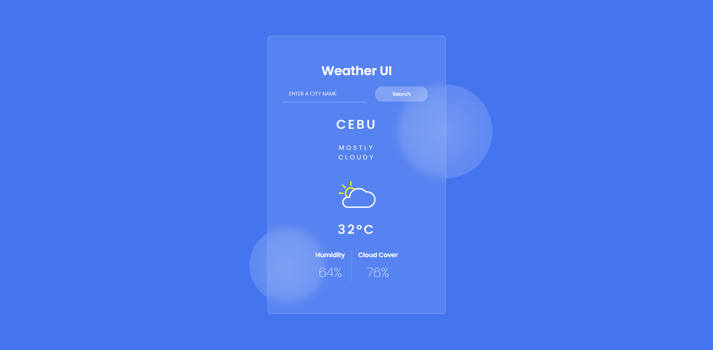

# Simple Weather UI using SASS

### Preview

### About this repo

This is a submission for a coding challenge called _"Quest #12: Weather UI"_ by a community named [StudevPH](https://facebook.com/groups/studevph).

### Socials

 
